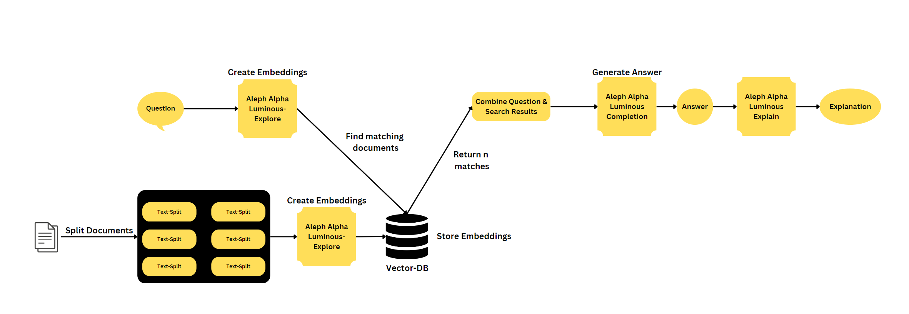
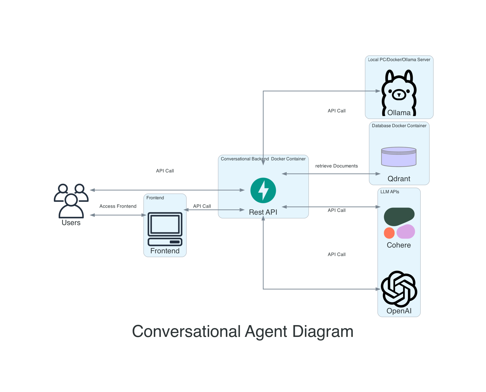

[](https://github.com/astral-sh/ruff)
<a href="https://github.com/psf/black"></a>

# Conversational Agent
This is a Rest-Backend for a Conversational Agent, that allows to embedd Documentes, search for them using Semantic Search, to QA based on Documents and do document processing with Large Language Models.


## Rework

At the moment i am reworking to langgraph, therefore not all versions on main will work with all of the providers. I will update the providers in the next weeks. Please use the releases to get a working version.

## Table of Contects
- [Conversational Agent](#conversational-agent)
  - [Rework](#rework)
  - [Table of Contects](#table-of-contects)
  - [LLMs and Backend Providers](#llms-and-backend-providers)
  - [Recent Updates](#recent-updates)
  - [Quickstart](#quickstart)
  - [Project Description](#project-description)
  - [Semantic Search](#semantic-search)
  - [Architecture](#architecture)
  - [Components](#components)
  - [Secret Management](#secret-management)
  - [Installation \& Development Backend](#installation--development-backend)
  - [Development Frontend](#development-frontend)
    - [Mypy](#mypy)
  - [Vector Database](#vector-database)
  - [Qdrant API Key](#qdrant-api-key)
  - [Bulk Ingestion](#bulk-ingestion)
  - [Update all dependencies](#update-all-dependencies)
  - [Star History](#star-history)


## LLMs and Backend Providers

- [Cohere](https://cohere.com/)
- [Ollama](https://ollama.com/)
- [(Azure) OpenAI](https://openai.com/)


## Recent Updates
- Complete Rework to Langgraph
- Adding Cohere
- Adding Ollama

If you want to use an Aleph Alpha only backend i would recommend my other backend: https://github.com/mfmezger/aleph-alpha-rag.


## Quickstart
To run the complete system with docker use this command:

```bash
git clone https://github.com/mfmezger/conversational-agent-langchain.git
cd conversational-agent-langchain
```
Create a .env file from the .env-template and set the qdrant api key. For tests just set it to test.
QDRANT_API_KEY="test"

Then start the system with
```bash
  docker compose up -d
```

Then go to http://127.0.0.1:8001/docs or http://127.0.0.1:8001/redoc to see the API documentation.

Frontend: localhost:8501
Qdrant Dashboard: localhost:6333/dashboard


## Project Description
This project is a conversational agent that uses Aleph Alpha and OpenAI Large Language Models to generate responses to user queries. The agent also includes a vector database and a REST API built with FastAPI.

Features
- Uses Aleph Alpha and OpenAI Large Language Models to generate responses to user queries.
- Includes a vector database to store and retrieve information.
- Provides a REST API built with FastAPI for easy integration with other applications.
- Has a basic gui.

## Semantic Search


Semantic search is an advanced search technique that aims to understand the meaning and context of a user's query, rather than matching keywords. It involves natural language processing (NLP) and machine learning algorithms to analyze and interpret user intent, synonyms, relationships between words, and the structure of content. By considering these factors, semantic search improves the accuracy and relevance of search results, providing a more intuitive and personalized user experience.

## Architecture


## Components

Langchain is a library for natural language processing and machine learning. FastAPI is a modern, fast (high-performance) web framework for building APIs with Python 3.7+ based on standard Python type hints. A Vectordatabase is a database that stores vectors, which can be used for similarity searches and other machine learning tasks.


## Secret Management

Two ways to manage your api keys are available, the easiest approach is to sent the api token in the request as the token.
Another possiblity is to create a .env file and add the api token there.
If you use OpenAI from Azure or OpenAI directly you need to set the correct parameters in the .env file.


## Installation & Development Backend

On Linux or Mac you need to adjust your /etc/hosts file to include the following line:

```bash
127.0.0.1 qdrant
```


First install Python Dependencies:

You need to instal rye if you want to use it for syncing the requirements.lock file. [Rye Installation](https://rye.astral.sh/guide/installation/).

```bash
rye sync
# or if you do not want to use rye
pip install -r requirements.lock
```

Start the complete system with:

```bash
docker compose up -d
```

To run the Qdrant Database local just run:

```bash
docker compose up qdrant
```


To run the Backend use this command in the root directory:

```bash
poetry run uvicorn agent.api:app --reload
```

To run the tests you can use this command:

```bash
poetry run coverage run -m pytest -o log_cli=true -vvv tests
```

## Development Frontend

To run the Frontend use this command in the root directory:

```bash
poetry run streamlit run gui.py --theme.base="dark"
```

### Mypy

mypy rag --explicit-package-bases

## Vector Database

Qdrant Dashboard is available at http://127.0.0.1:6333/dashboard. There you need to enter the api key.

## Qdrant API Key
To use the Qdrant API you need to set the correct parameters in the .env file.
QDRANT_API_KEY is the API key for the Qdrant API.
And you need to change it in the qdrant.yaml file in the config folder.

## Bulk Ingestion

If you want to ingest large amount of data i would recommend you use the scripts located in agent/ingestion.


## Update all dependencies

```
poetry add langchain@latest loguru@latest omegaconf@latest aleph-alpha-client@latest tiktoken@latest python-dotenv@latest httpx@latest python-multipart@latest fastapi@latest openai@latest grpcio@latest grpcio-tools@latest uvicorn@latest gpt4all@latest nltk@latest pypdfium2@latest lingua-language-detector@latest pyarrow@latest aiohttp@latest gitpython@latest jinja2@latest langchain-openai@latest
```


## Star History

<a href="https://star-history.com/#mfmezger/conversational-agent-langchain&Date">
  <picture>
    <source media="(prefers-color-scheme: dark)" srcset="https://api.star-history.com/svg?repos=mfmezger/conversational-agent-langchain&type=Date&theme=dark" />
    <source media="(prefers-color-scheme: light)" srcset="https://api.star-history.com/svg?repos=mfmezger/conversational-agent-langchain&type=Date" />
    
  </picture>
</a>
